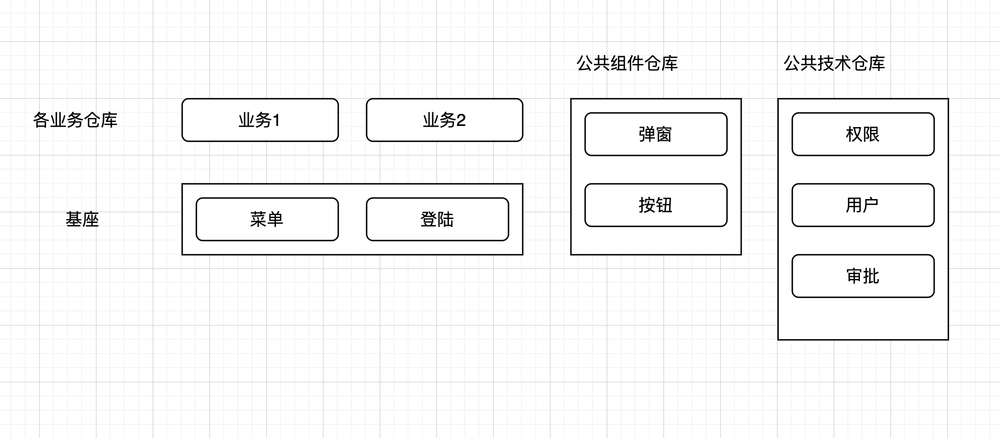

- 微前端基础架构拆分

- 当前demo的配置
- [x] main, sub-app-x, components均使用react
- [x] 在基座中路由的处理
- [ ] 在子组件中路由的处理
- [ ] 添加一个fake server
- [ ] 在公共组件中添加一个弹窗
- [ ] 在公共技术仓库添加一个用户管理
- [ ] 使用monorepo，使用lerna, nx, pnpm
- [ ] 共用一套lint配置